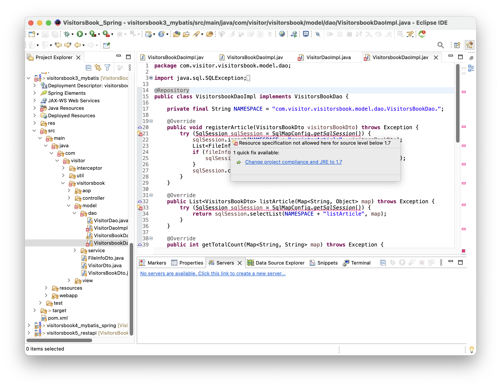
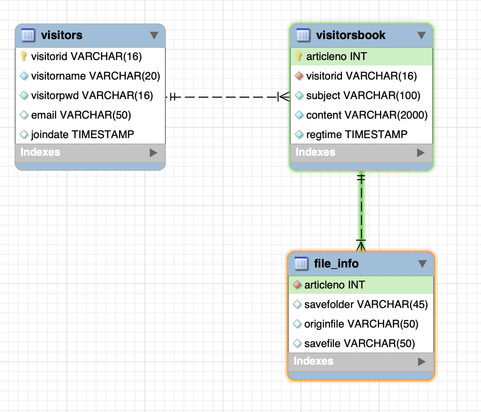
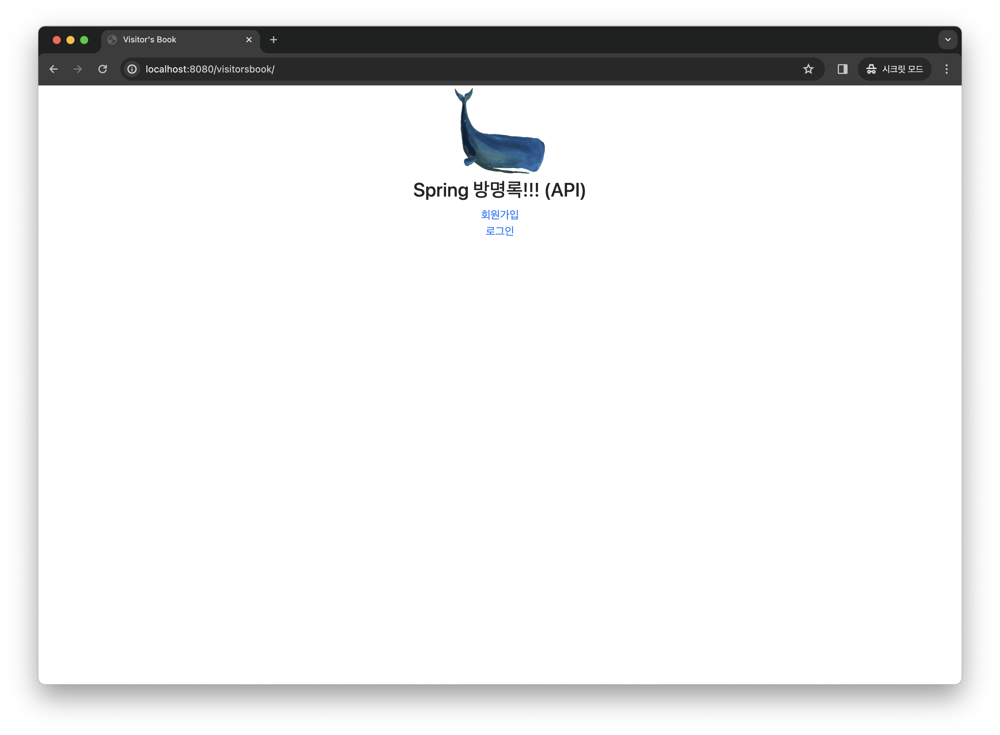
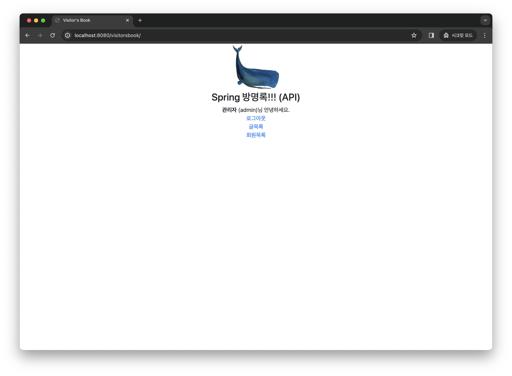
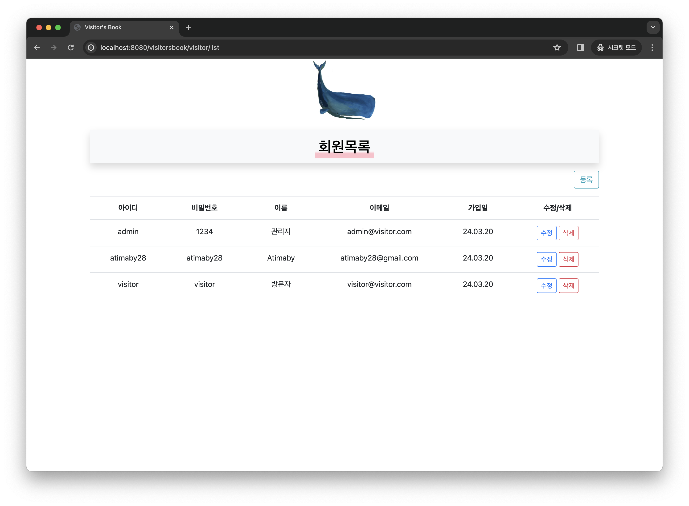
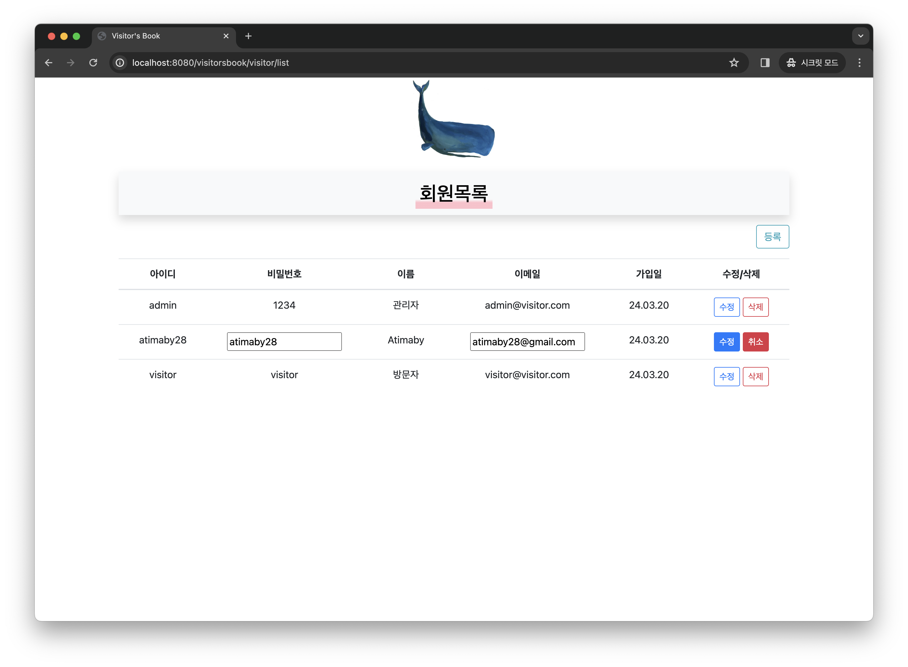
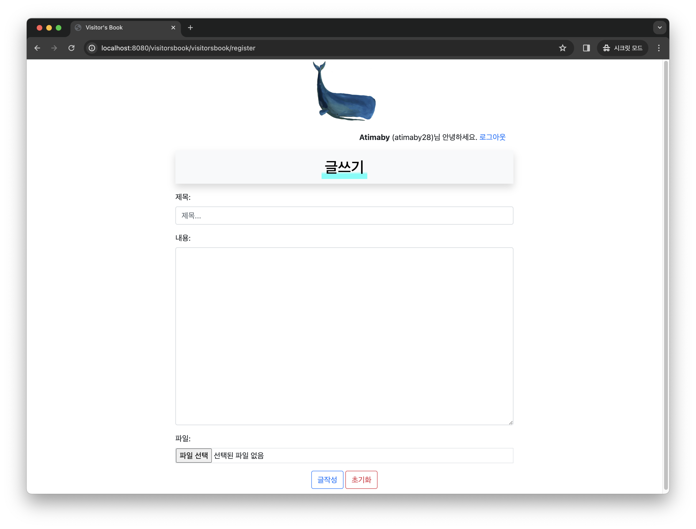
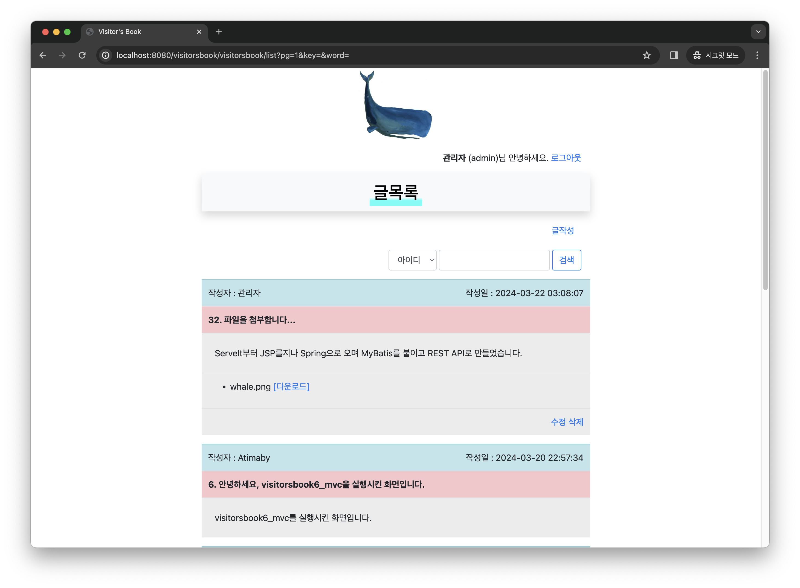

# VisitorsBook_Spring

 

 ## 🌱 Spring를 이용한 방명록 만들기

  

 ### 프로젝트의 특징

 

스프링 부트(Spring Boot)를 공부하기 전 Spring의 기본 개념과 몇 가지 기능을 추가하고 MyBatis를 연동하는 과정을 알아보며  
스프링 부트(Spring Boot)의 탄생 배경을 이해합니다.
 

 

### 환경설정

  

 

최신버전을 사용함에 다음과 같은 문제가 있었기 때문에 pom.xml에 정의되어 있는 코드를 따르는 것이 좋습니다.

 

### 프로젝트 소개

 

먼저 프로젝트에 사용되는 DB의 구조는 다음과 같습니다.

 

 
 

다음은 구현된 화면입니다.

 

 

Servelt-JSP와 비슷한 첫 랜딩 페이지입니다.

 

 

그렇지만, 관리자(admin)으로 로그인한다면 회원목록 버튼이 활성화됩니다.

 

 

회원목록을 확인할 수 있습니다.

 

 

회원을 관리자 권한으로 수정할 수 있습니다.

 

 

비슷한 글쓰기 화면이지만 파일 첨부기능이 추가되었습니다.

 

 

마지막 글을 쓰고 난 후 화면입니다.

---
